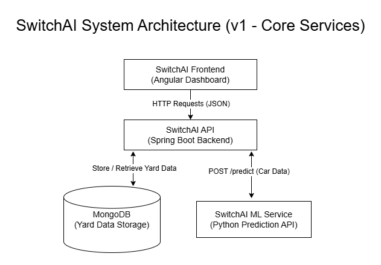

# 🚂 The Problem: Rail Yard Classification at Scale

## Overview

Modern freight rail yards—especially large hump yards like Rice Yard in Waycross, GA operated by CSX Transportation—are responsible for sorting thousands of railcars per day into outbound trains.

Each railcar must be assigned to the correct classification track (bowl track) based on its destination, routing, and operational constraints.

At scale, this becomes a complex, real-time decision problem involving:

- Limited track capacity
- Unpredictable train arrivals
- Conflicting priorities
- Physical and safety constraints
- Downstream network dependencies

---

## How a Hump Yard Works (Simplified)

Rail yard operations follow a pipeline:

### 1. Intake (Receiving Yard)
- Trains arrive and occupy receiving tracks
- Cars are inspected and prepared for classification

### 2. Classification (Hump + Bowl)
- Cars are pushed over a hump and routed into tracks
- Each track represents a destination or outbound block

### 3. Outbound Build (Pull-down)
- Tracks are pulled and assembled into outbound trains
- Trains are built in a specific order and depart

---

## Core Operational Challenges

### 1. Arrival Variability
Trains do not arrive evenly—they "bunch."

**Impact:**
- Receiving yard congestion
- Delays before classification begins
- Unbalanced workload across the yard

---

### 2. Hump vs Pull-down Imbalance
Cars can be classified faster than they can be assembled into outbound trains.

**Impact:**
- Bowl tracks fill up
- Reduced effective capacity
- Forced suboptimal decisions

---

### 3. Track Contamination ("Dirty Tracks")
Incorrect or poorly planned assignments lead to mixed or unusable tracks.

**Impact:**
- Rework (re-humping, doubling, digging cars out)
- Increased dwell time
- Reduced throughput

---

### 4. Capacity Constraints
Each track has limits:

- Number of cars
- Total weight
- Operational restrictions

**Impact:**
- Invalid assignments
- Overflow conditions
- Increased manual intervention

---

### 5. Misroutes and Rework
Even small error rates scale quickly.

**Impact:**
- 15–20 minute delays per incident
- Cascading downstream effects
- Increased labor and resource usage

---

### 6. Downstream Dependencies
Outbound trains must be built correctly and on time.

**Impact:**
- Missed connections
- Network-wide delays
- Reduced service reliability

---

## Why This Problem Is Hard

Rail yard classification is not just about assigning a car to a track.

It is about making the **best possible decision given the current state of the yard**, including:

- Track availability
- Current occupancy
- Future demand
- Train priorities
- Operational constraints

Every decision affects future decisions.

---

## Opportunity for Machine Learning

Machine learning can assist by improving decision quality, not replacing operations.

Key opportunities include:

- Predicting train arrivals and yard congestion
- Recommending optimal track assignments
- Identifying high-risk decisions (misroutes, rework)
- Improving yard flow and reducing dwell time

---

## Project Goal

This project aims to simulate and solve a simplified version of this problem by:

- Modeling railcars, tracks, and classifications
- Enforcing operational constraints
- Integrating a machine learning service for track recommendations
- Building a backend system that reflects real-world yard decision workflows

---

## Summary

> The challenge is not just sorting railcars —  
> it is maintaining flow across an entire constrained system in real time.

This project focuses on building a system that can:

- Understand the state of a rail yard
- Make feasible, explainable assignment decisions
- Evolve toward intelligent, data-driven optimization  


# 💡 The Solution: SwitchAI

SwitchAI is a backend system designed to simulate and improve rail yard classification decisions.

It models railcars, classifications, and (future) yard constraints, while integrating with a machine learning service to recommend track assignments.

The system is built with a microservices-ready architecture:

- Spring Boot handles core business logic and data persistence
- MongoDB stores operational data
- A separate Python ML service generates track predictions

---

## 🎯 What This System Does

- Stores and manages railcar data
- Requests track predictions from an ML service
- Validates and persists classification decisions
- Provides APIs for querying and filtering yard activity

---

## 🔄 Current Workflow 

1. Client submits railcar data
2. Railcar is stored in MongoDB
3. Track data exists with:
    - capacity (length in feet)
    - allowed destinations
    - availability status
4. Client requests a prediction using `railcarId`
5. Spring Boot calls the ML service
6. ML returns a recommended track
7. Backend evaluates all tracks and filters **valid tracks** based on:
    - destination match
    - available capacity
    - track status
8. System compares ML recommendation against valid tracks:
    - If valid → assign ML track
    - If invalid → assign fallback track
9. Classification is saved in MongoDB with:
    - recommendedTrack (ML output)
    - assignedTrack (final decision)
    - assignmentSource (ML or FALLBACK)
10. Result is returned to the client

---

## 🚧 Current Limitations (Next Improvements)

The system now includes core constraint logic and ML validation. Next improvements:

- Track capacity updates over time (increment `usedLengthFeet`)
- Prevent track overfilling across multiple assignments
- Smarter fallback logic (best-fit instead of first valid track)
- Grouping logic for outbound train blocks
- Yard-state-aware decision making (congestion, balancing)
- Replace mock ML with real predictive model
- Improved API responses (DTOs, pagination, sorting)
- Better error handling (avoid generic 500 responses)

---

## 🎯 Goal

Evolve this system into a realistic prototype of a rail yard decision engine that:

- Understands yard constraints
- Makes feasible assignment decisions
- Integrates machine learning as a recommendation layer  


# SwitchAI Backend (v1)

SwitchAI is a backend system for managing railcar data and predicting yard track assignments using a machine learning service.

---

## 🚀 Tech Stack

- Java 17+
- Spring Boot
- MongoDB
- Python (Flask) – ML Service
- REST APIs

---

## 🏗️ Architecture

```
Frontend (Angular)
        ↓
Spring Boot API (Java)
   ↙            ↘
MongoDB      ML Service (Python Flask)
```



---

## 📦 Project Structure

```
com.switchai.switchai_backend
│
├── config
│   └── AppConfig
│
├── railcar
│   ├── Railcar
│   ├── RailcarController
│   ├── RailcarService
│   ├── RailcarRepository
│   ├── Classification
│   ├── ClassificationRepository
│   ├── PredictionRequest
│   └── PredictionResponse
│
├── exception
│   └── GlobalExceptionHandler
│
└── SwitchaiBackendApplication
```

---

## 🔌 API Endpoints

### Railcars

#### Create Railcar
```
POST /railcars
```

#### Get All / Filter
```
GET /railcars
GET /railcars?destination=ATL
GET /railcars?trainId=Q123
GET /railcars?destination=ATL&trainId=Q123
```

#### Get by ID
```
GET /railcars/{id}
```

---

### Predictions

#### Predict Track (via ML service)
```
POST /railcars/predict
```

Body:
```json
{
  "railcarId": "mongo_id_here"
}
```

Response:
```json
{
  "railcarId": "mongo_id_here",
  "predictedTrack": 61
}
```

---

### Classifications

#### Get All / Filter
```
GET /railcars/classifications
GET /railcars/classifications?railcarId=...
```

---

## 🤖 ML Service (Python)

Location:
```
/ml-service/app.py
```

Run:
```bash
python app.py
```

Runs on:
```
http://localhost:5000
```

Endpoint:
```
POST /predict
```

---

## 🗄️ MongoDB

Default connection:
```
mongodb://localhost:27017
```

Collections:
- railcars
- classifications

---

## ✅ Features Implemented

- Railcar CRUD (basic)
- Filtering (destination, trainId)
- ML integration via REST call
- Classification persistence
- Validation (input constraints)
- Global exception handling
- Clean layered architecture

---

## ⚠️ Validation Rules

- trainId, origin, destination, carType → required
- weight, length → must be positive

---

## 🧪 Running the System

### 1. Start MongoDB

### 2. Start ML Service
```bash
cd ml-service
python app.py
```

### 3. Start Spring Boot App

Run:
```
SwitchaiBackendApplication
```

---

## 📌 Next Steps (Planned)

- Track capacity logic (yard simulation)
- Pagination
- Authentication
- Docker setup
- Microservices split (API / ML / Data)

---

## 🧠 Notes

- ML service is currently mocked (hash-based prediction)
- Designed to evolve into microservices architecture

---

## 👨‍💻 Author

SwitchAI Project